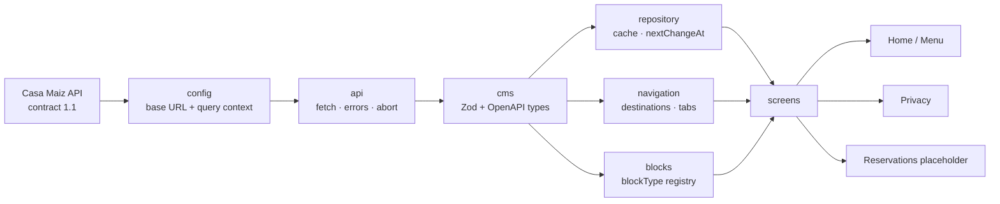

# Casa Maiz

React Native CLI + TypeScript client for the published [Casa Maiz Payload CMS](https://payload-cms-poc-seven.vercel.app/api/docs). The app does not own editorial copy: Home, Menu, Privacy, navigation labels, promotions, alerts, and operational notices come from contract **1.1**.

The CMS is treated as an external versioned API. This repository does not contain CMS source and must not write to the shared `POST /api/form-submissions` endpoint.

Default API: `https://payload-cms-poc-seven.vercel.app`  
OpenAPI: https://payload-cms-poc-seven.vercel.app/api/openapi.json

## Prerequisites

Follow the official [React Native environment setup](https://reactnative.dev/docs/set-up-your-environment) for your OS. This project is **React Native CLI 0.87**, not Expo.

- Node.js **22.11+** (`package.json` `engines`)
- npm
- Xcode + CocoaPods (iOS)
- Android Studio, JDK, and an emulator or device (Android API 24+)
- Ruby + Bundler for `ios/` CocoaPods (`Gemfile`)

No API keys. Content endpoints used here are unauthenticated.

## Configuration

The API base URL is a single constant, then injected into the HTTP client:

```ts
// src/config/api.ts
export const DEFAULT_API_BASE_URL =
  'https://payload-cms-poc-seven.vercel.app';
```

`createCmsClient({ baseUrl })` accepts an override (tests do this). Screens never build URLs.

Every content GET adds the four required query params from `src/config/contentContext.ts`:

| Param | Source |
|---|---|
| `platform` | `ios` or `android` from `Platform.OS` |
| `market` | `MX` |
| `audience` | `guest` |
| `appVersion` | semver `1.0.0` (`package.json` version) |

Do not put machine-specific hosts, tokens, or `.env` files in the repo.

### Emulator and device networking

The default base URL is public HTTPS. Simulator, emulator, and physical devices reach it with no extra hosts.

If you point `DEFAULT_API_BASE_URL` at a CMS on your machine:

| Target | Host to use |
|---|---|
| iOS Simulator | `http://localhost:<port>` |
| Android Emulator | `http://10.0.2.2:<port>` ([Android emulator networking](https://developer.android.com/studio/run/emulator-networking)) |
| Physical device | Your computer's LAN IP, and the device on the same network |

HTTP (not HTTPS) on Android also needs cleartext permitted for that host. Keep that change local; do not commit debug cleartext for a public review build.

## Install

```sh
git clone <this-repo>
cd CasaMaizChallenge
npm install
```

iOS native modules:

```sh
bundle install
bundle exec pod install --project-directory=ios
```

## Run

Start Metro, then the platform binary:

```sh
npm start
```

```sh
npm run ios
# or
npm run android
```

iOS bundle id: the Xcode target `CasaMaizChallenge`.  
Android application id: `com.casamaizchallenge`.

Deep links (bonus): `casamaiz://`, `casamaiz://menu`, `casamaiz://legal/privacy_policy`, `casamaiz://reservas`. Reservations is a local placeholder screen, not a CMS transaction.

## Android debug APK

No APK is committed (binaries bloat git history). Build it locally after `npm install`:

```sh
cd android
./gradlew assembleDebug
```

Output:

`android/app/build/outputs/apk/debug/app-debug.apk`

Install on a device or emulator:

```sh
adb install -r android/app/build/outputs/apk/debug/app-debug.apk
```

Application id: `com.casamaizchallenge`. Needs the same Android SDK / JDK as `npm run android`. The debug APK still talks to the published Casa Maiz API over HTTPS.

## Quality commands

```sh
npm run typecheck   # tsc --noEmit
npm run lint        # ESLint
npm test            # Jest
```

Optional:

```sh
npm run cms:types              # regenerate src/cms/generated/openapi.ts
npm run test:visual:android    # Maestro + pixelmatch (see e2e/maestro/README.md)
```

## Architecture

Screens do not fetch, build query strings, or parse destinations. Full notes: [docs/architecture.md](docs/architecture.md).



| Layer | Role |
|---|---|
| `src/config` | Base URL, market, audience, app version |
| `src/api` | `fetch`, non-2xx, malformed JSON, `AbortSignal` |
| `src/cms` | Envelope 1.1, bootstrap/page/legal parsers, media URLs |
| `src/repository` | Last successful envelope; refuse cache past `nextChangeAt` |
| `src/navigation` | CMS paths → native stack/tabs; validate external URLs |
| `src/blocks` | `blockType` → component; unknown types render a fallback |
| `src/screens` | Presentation, loading / empty / retry / offline banners |

Home and Menu render `data.layout` through `src/blocks/registry.ts`. Adding a documented block is a registry entry plus a component; screens stay unchanged.

Bootstrap drives tabs, top-bar alerts (`frequency.type`: `always` + cooldown, `once`, `session`), kitchen/operational notice, recommended or required app update, and Home promotions when `enable_new_home` is on. Missing optional bootstrap fields leave the app usable.

Privacy loads `GET /api/content/v1/legal/privacy_policy`. Reservations (`/reservas`) opens a local placeholder screen (no reservation API is documented).

### OpenAPI types vs Zod

Both are used, for different jobs.

- **Generated OpenAPI** (`npm run cms:types` → `src/cms/generated/openapi.ts`) is compile-time only. It documents the published contract and types query params / form body shapes. TypeScript erases it; nothing in that folder runs on the device. Tool: [openapi-typescript](https://openapi-ts.dev/introduction).
- **Zod** parsers (`envelope`, `page`, `bootstrap`, …) are the runtime contract. They accept `unknown` JSON, keep the fields the app uses, tolerate extra keys, and fail safely on a bad `contractVersion` or a malformed envelope. Library: [Zod](https://zod.dev/).

A generated type is never used as a runtime parser. The spec can be stricter than live payloads (nulls, incomplete blocks). Zod is what we trust after the network.

### Cache and `nextChangeAt`

The repository persists the last successful live envelope (not `preview`, not already expired). If the network fails, still-valid cache is shown with an offline banner. Cache at or after `nextChangeAt` is treated as expired and is not shown as current content. If there has never been a successful load, the UI is a retry state, not a blank screen.

Requests take an `AbortSignal`. Unmount or a newer request aborts the previous `fetch` so a late response cannot overwrite UI.

### Forms

`formBlock` builds the OpenAPI `MobileFormSubmissionRequest` body and submits through `submitFormMock`. It never POSTs to the shared public environment.

## Dependency choices

Kept small on purpose.

| Dependency | Why |
|---|---|
| `@react-navigation/native-stack` + `bottom-tabs` | Native stack/tab chrome; already specified for this assessment. Docs: [native stack](https://reactnavigation.org/docs/native-stack-navigator/) |
| `react-native-screens` / `safe-area-context` | Required peers for React Navigation |
| `@react-native-async-storage/async-storage` | Persist last successful content. Docs: [Async Storage](https://react-native-async-storage.github.io/async-storage/) |
| `zod` | Runtime envelope/bootstrap/page validation |
| `openapi-typescript` (dev) | Generated CMS types |
| `@types/node` (dev) | Type-check Node helpers used by Maestro compare and `cms:types` tests |

Intentionally **not** used: Expo, NativeWind, FlashList, LegendList, Reanimated, `expo-image`. Images use React Native `Image`. Horizontal rails use `FlatList`. Page bodies use `ScrollView` because live Home/Menu layouts are short.

## Platform behavior

- iOS: native stack back gesture, translucent header when Reduce Transparency is off
- Android: system back, ripple on pressables, Material-leaning surfaces
- 44pt minimum targets, `allowFontScaling` with a cap, dark/light theme, Reduce Motion (zero-duration transitions)

## Trade-offs

- **Page `ScrollView` vs a virtualized feed.** Live layouts are a handful of blocks. A FlashList of mixed `blockType`s would add a dependency the assessment asked us not to default to, without changing first paint.
- **App version is the binary semver we ship (`1.0.0`), not a live store lookup.** That matches the required query format.
- **Reservations is a placeholder screen, not a fake booking flow.** No transaction API exists; inventing one would look like product work the CMS cannot back.
- **Feature flags are capability keys, not copy.** `enable_new_home` shows Home promotions once: the page `promoRail` if the layout has it, otherwise `bootstrap.promotions`. The same title/id is not rendered twice. Flag off hides both. `show_store_locator_banner` only renders if the CMS also sends locator copy.

## Known limitations

- Live Home/Menu are short; the page body is a `ScrollView`, not a virtualized feed of blocks.
- Documented blocks not present in the live payload (`cta`, `content`, `mediaBlock`, `archive`) use the unknown-block fallback.
- `formBlock` is mocked and never POSTs to the shared public API.
- Reservations has no transaction API — local placeholder screen only.
- Maestro visual regression is reliable on Android; iOS XCUITest hangs on Xcode 26.6 ([Maestro #3137](https://github.com/mobile-dev-inc/maestro/issues/3137)).

With more time: crash/content telemetry, release-build profiling on device, and a required-update store URL only if the CMS provides one.

## Docs

- Architecture diagram: [docs/architecture.md](docs/architecture.md)
- Accessibility: [docs/accessibility.md](docs/accessibility.md)
- Performance: [docs/performance.md](docs/performance.md)
- Visual regression: [e2e/maestro/README.md](e2e/maestro/README.md)
- Generated types: [src/cms/generated/README.md](src/cms/generated/README.md)
