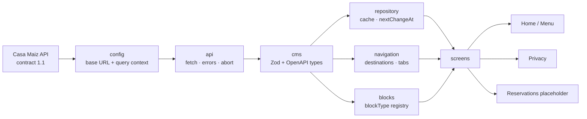
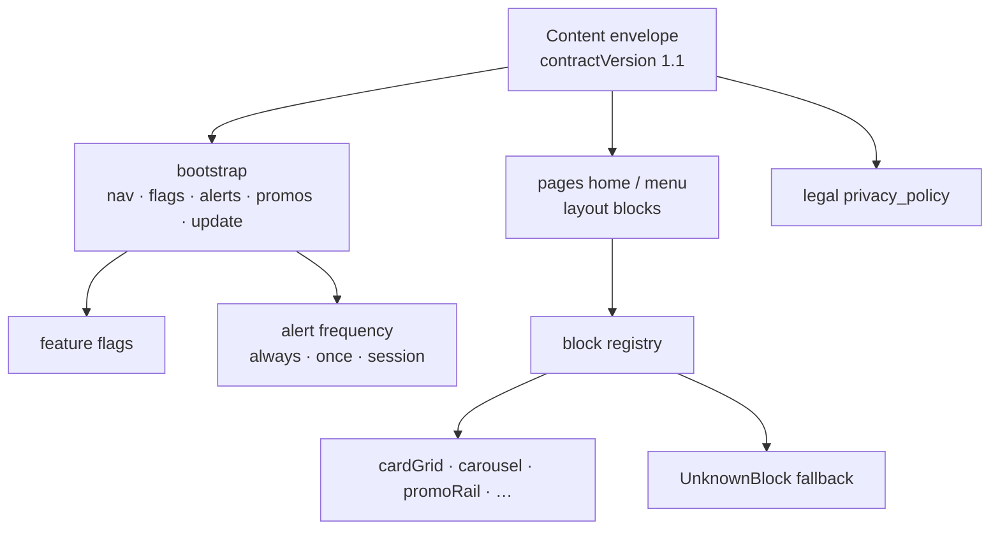

# Architecture

Screens stay dumb: they do not build query strings, parse destinations, or call `fetch`. The same diagram is embedded in the root [README](../README.md).

## Pipeline

## Inside `cms`

## Layer notes

| Layer | Owns | Does not own |
|---|---|---|
| `src/config` | Base URL, market, audience, semver | Screens |
| `src/api` | Transport, status codes, abort | CMS field meaning |
| `src/cms` | Contract 1.1, parsers, flags, media URLs | Navigation chrome |
| `src/repository` | Persist / expire envelopes | UI copy |
| `src/navigation` | Path → screen, HTTPS check | Layout blocks |
| `src/blocks` | `blockType` → component | Fetch |
| `src/screens` | Loading / empty / retry / banners | Query construction |

Adding another documented CMS block: register a component in `src/blocks/registry.ts`. Home and Menu do not change.

Migrating off contract `1.1`: keep Zod as the runtime gate; bump `SUPPORTED_CONTRACT_VERSION` and fail safe until parsers catch up. OpenAPI types regenerate with `npm run cms:types`.

## Key trade-offs

| Decision | Chose | Rejected / deferred | Why |
|---|---|---|---|
| Page body scrolling | `ScrollView` of registry blocks | FlashList / LegendList feed of mixed `blockType`s | Live Home/Menu are a handful of blocks. Virtualizing them adds a dependency the assessment asked us not to default to, without changing first paint. |
| Images | React Native `Image` | `expo-image` | No Expo in this CLI app. Resolve absolute CDN URLs and relative Payload paths in the CMS client. |
| Lists in blocks | `FlatList` for horizontal rails | FlashList / LegendList by default | Matches assessment guidance; rails are short. |
| App version query param | Binary semver we ship (`1.0.0`) | Live App Store / Play lookup | Contract requires `appVersion` as semver in the query context; store lookup is out of scope and would drift from the binary. |
| Reservations (`/reservas`) | Local placeholder screen | Fake booking / payment flow | No reservation transaction API is documented. Inventing one would be product work the CMS cannot back. |
| Form submit | `submitFormMock` with OpenAPI body shape | `POST /api/form-submissions` | Shared public endpoint must not receive writes from this assessment client. |
| Feature flags | Capability keys only | Hardcoded promo / locator copy | `enable_new_home` shows Home promotions once (page `promoRail` if present, else `bootstrap.promotions`; no duplicate title/id). Off hides both. `show_store_locator_banner` only renders when the CMS also sends locator copy. |
| Runtime contract | Zod parsers on `unknown` JSON | Trust generated OpenAPI types at runtime | OpenAPI is compile-time docs; live payloads can be looser (nulls, incomplete blocks). Zod fails safe on bad `contractVersion` or malformed envelopes. |
| Offline UX | One shell-level offline banner + still-valid cache | Per-screen offline chrome / show expired cache | Same bar above the navigator on every screen. Cache at or after `nextChangeAt` is never shown as current. |
| Navigation chrome | `@react-navigation/native-stack` + `bottom-tabs` | JS stack / Expo Router / native bottom-tabs package | Already specified for the assessment; native transitions and platform back behavior. |

## Known limitations (same doc)

- Documented blocks absent from the live payload (`cta`, `content`, `mediaBlock`, `archive`) use the unknown-block fallback.
- Maestro visual regression is reliable on Android; iOS XCUITest hangs on Xcode 26.6 ([Maestro #3137](https://github.com/mobile-dev-inc/maestro/issues/3137)).
- With more time: crash/content telemetry, release-build profiling on device, and a required-update store URL only if the CMS provides one.

> Preview: open this file on GitHub (Mermaid renders in the markdown view) or in an editor with a Mermaid preview. Cursor / VS Code: “Markdown: Open Preview”.
