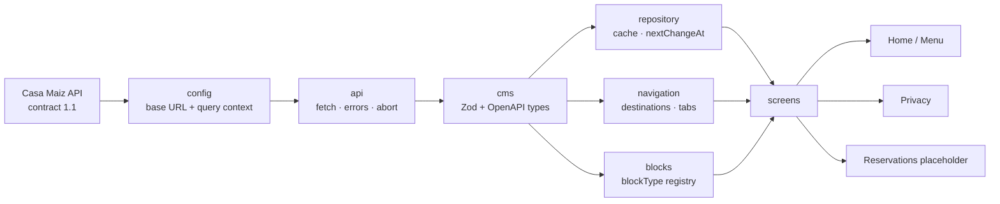
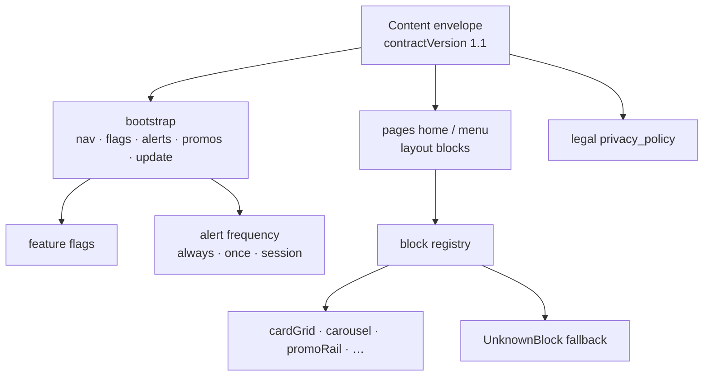

# Architecture

Screens stay dumb: they do not build query strings, parse destinations, or call `fetch`. The same diagram is embedded in the root [README](../README.md).

## Pipeline

## Inside `cms`

## Layer notes

| Layer | Owns | Does not own |
|---|---|---|
| `src/config` | Base URL, market, audience, semver | Screens |
| `src/api` | Transport, status codes, abort | CMS field meaning |
| `src/cms` | Contract 1.1, parsers, flags, media URLs | Navigation chrome |
| `src/repository` | Persist / expire envelopes | UI copy |
| `src/navigation` | Path → screen, HTTPS check | Layout blocks |
| `src/blocks` | `blockType` → component | Fetch |
| `src/screens` | Loading / empty / retry / banners | Query construction |

Adding another documented CMS block: register a component in `src/blocks/registry.ts`. Home and Menu do not change.

Migrating off contract `1.1`: keep Zod as the runtime gate; bump `SUPPORTED_CONTRACT_VERSION` and fail safe until parsers catch up. OpenAPI types regenerate with `npm run cms:types`.

> Preview: open this file on GitHub (Mermaid renders in the markdown view) or in an editor with a Mermaid preview. Cursor / VS Code: “Markdown: Open Preview”.
